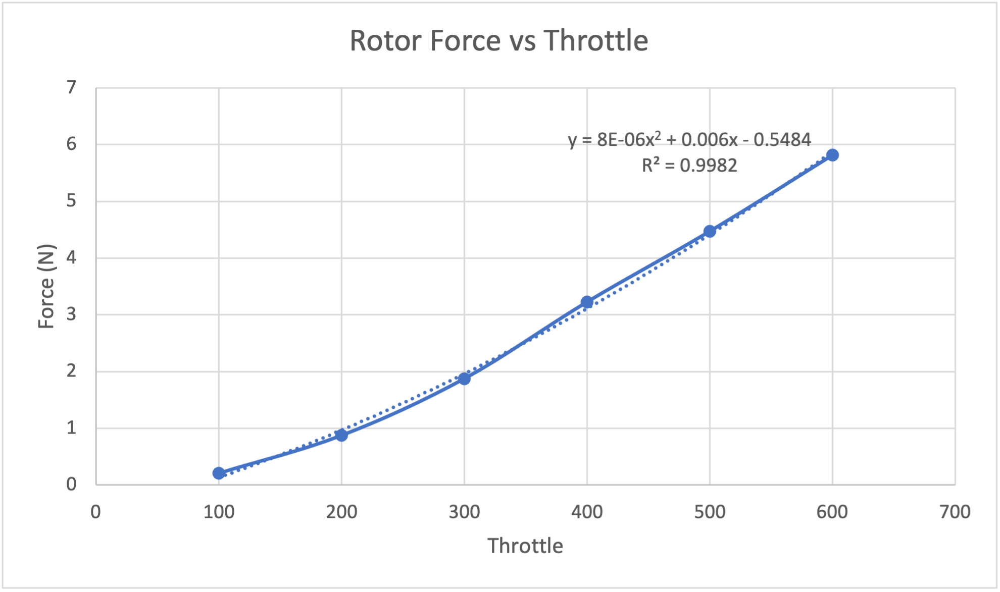
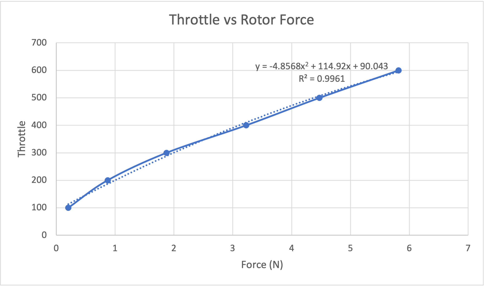
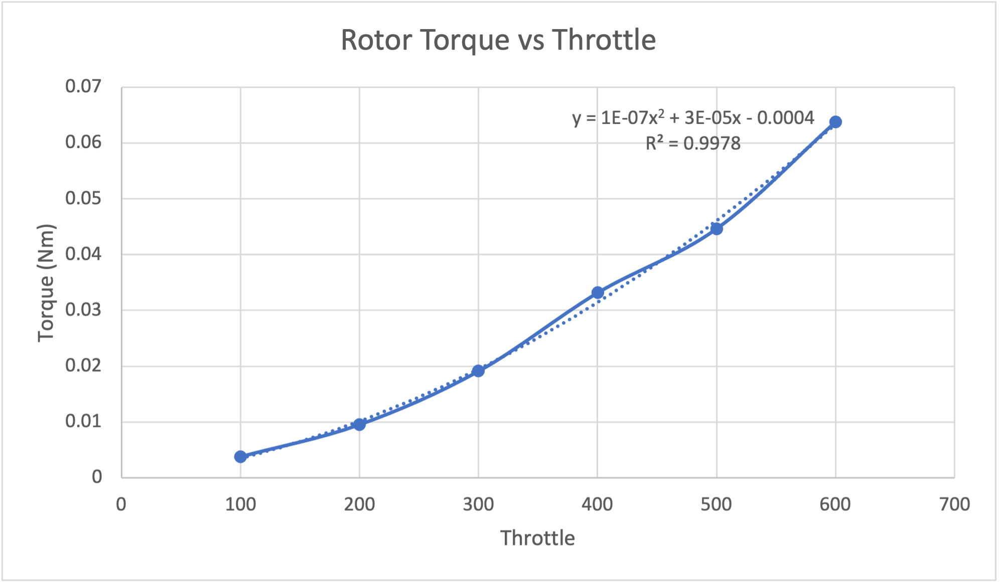
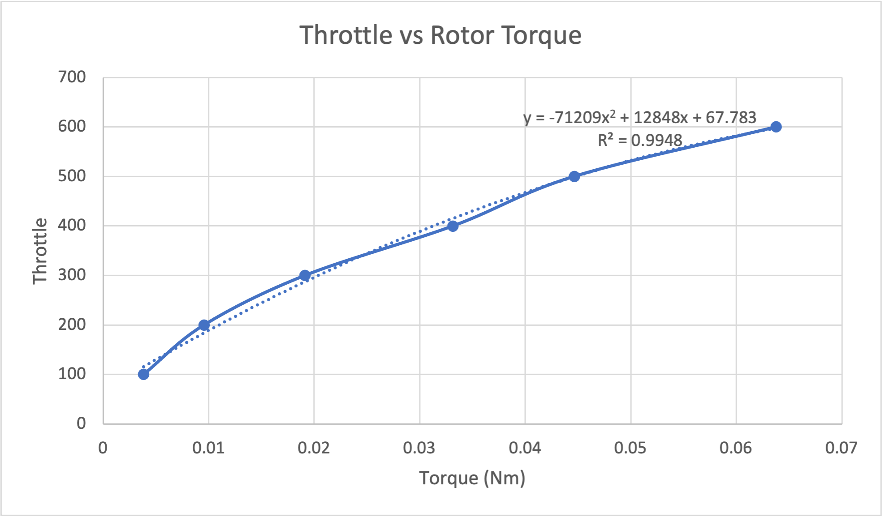
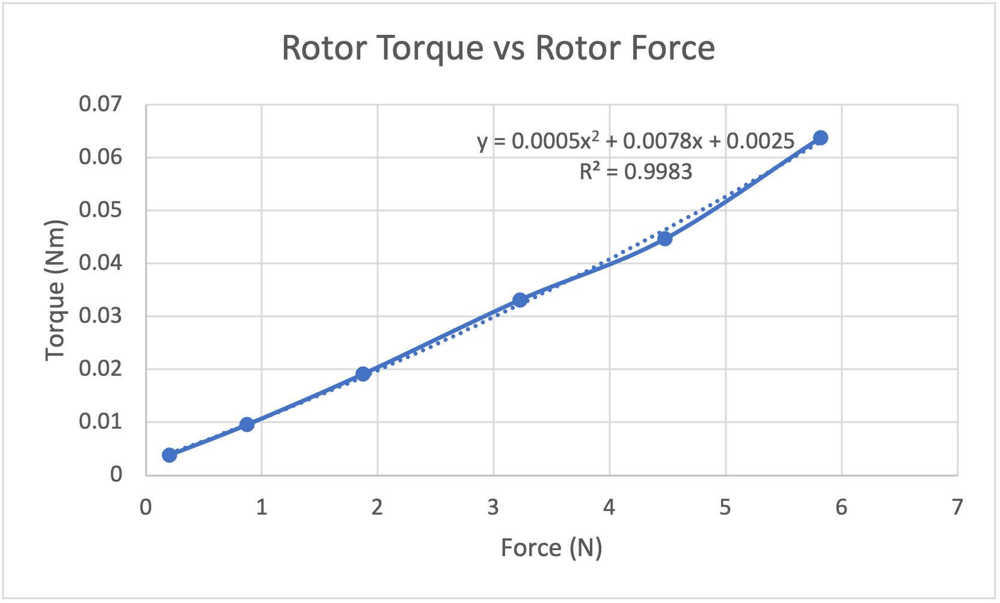

# QCS Rotor Testing

### Testing the rotors to determine the relationship between throttle signal, rotor force, and rotor torque.

#### The following are the equations for converting a desired torque or force into a throttle signal (standard SI units):

## Throttle = -4.8568*F^2 + 114.92*F + 90.043

## Throttle = -71209*T^2 + 12848*T + 67.783

#### Relationship between force and torque:

## T = 0.0005*F^2 + 0.0078*F + 0.0025

### The above results were obtained using a test rig to transfer the force and torque of the rotor to a digital scale.
### The rotor was oriented horizontally to avoid ground effects.

#### Setup for measuring force:

#### Setup for measuring torque:

#### The measured data:

