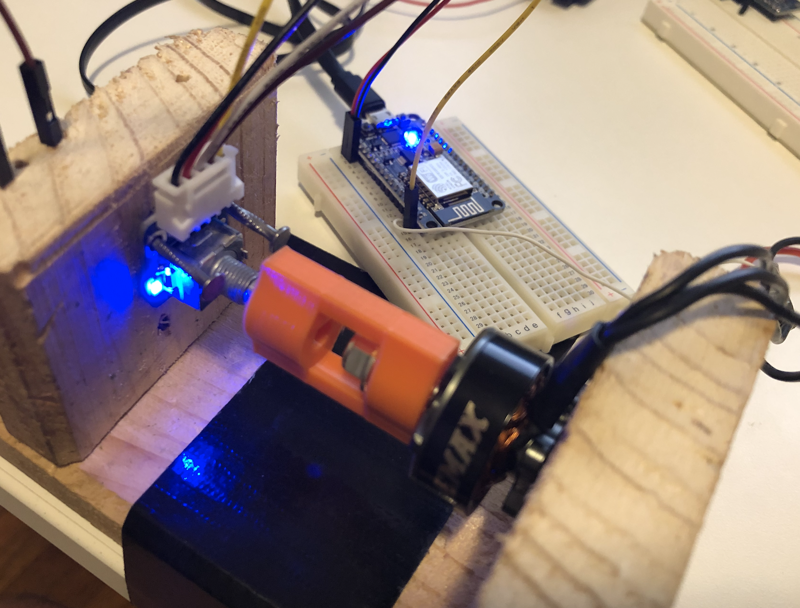

# QCS Motor Testing
#### Testing the motors to determine the relationship between input signal and shaft output speed to use for simulation and control system tuning.

#### The ESC accepts a 20ms period PWM signal with pulse widths ranging between 1000-2000us.

#### A test was performed to determine the gain from microseconds input signal to rad/s output speed. The measuring device used was a rotary optical encoder which was attached to the motor shaft with a simple 3D printing coupling. The two devices were mounted together in a simple frame and controlled with an NodeMCU microcontroller running some simple Arduino code.

#### The output of the rotary encoder computed as rad/s within the program and logged to the serial monitor. The test consisted of 10 samples taken at every 10us increment between 1000 and 2000. However, due to limitations in the test rig, readings were only able to be made up to 1400us. Each sample consisted of counting the number of encoder pulses during a 100ms window and converting to rad/s using the below formula.

#### The results are shown in the graph below. The input signal is shown as the number of microseconds that the pulse width is greater than one thousand as 1000us pulse width represents zero throttle. The motor has a deadzone at less than 1030us pulse width where the motor does not spin continuously. 

#### The throttle signals in the control system and airframe model will be represented as an integer between 0 and 1000. The gain to convert from throttle signals to motor shaft speed in rad/s used in the model will be set to 3 and the throttle signals will pass through a saturation block to ensure signals are between 30 and 1000 to avoid the deadzone.

#### The relationship found in this test supports what would be the approximate expected output speed range of a 2400kV running on a 14.8V battery.
